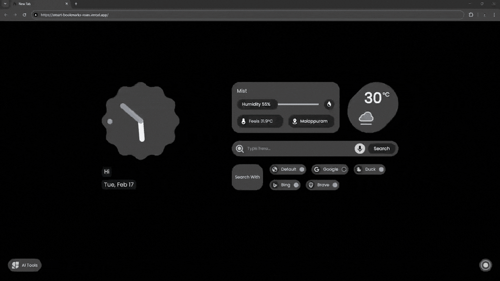

# Smart Bookmark App



A high-performance, real-time bookmark management system built with **Next.js 16** and **Supabase**. This application features instant data synchronization across multiple devices and tabs, secure Row Level Security (RLS), and a responsive, modern UI.

## 🌐 Vercel Live Demo

**Live Application:** https://smart-bookmarks-roan.vercel.app/


## 🏗️ System Architecture

The application utilizes a **Subscriber/Publisher** model for data synchronization:

1. **Client A**: Sends an `INSERT` request to Supabase.
2. **Database**: Commits the transaction to PostgreSQL.
3. **WAL**: Postgres Write Ahead Log detects the change.
4. **Realtime Service**: Broadcasts the full payload via WebSockets.
5. **Client B**: Receives payload, verifies `user_id` via RLS, and updates local state.

---

## 🛠️ Tech Stack

| Layer | Technology |
| --- | --- |
| **Frontend** | [Next.js 16.1.6]() (App Router) |
| **Core** | [React 19]() (Server Components) |
| **Styling** | [Tailwind CSS]() (Glassmorphism) |
| **Backend** | [Supabase]() (PostgreSQL) |
| **Realtime** | PostgreSQL Logical Replication |
| **Auth** | Google OAuth via Supabase Auth |

---

## 🚀 Key Features

* **Real-Time Sync**: Add/Delete bookmarks and see changes instantly across all tabs.
* **Optimistic UI**: Instant local updates for a "zero-latency" user experience.
* **Hardened Security**: PostgreSQL RLS ensures users only access their own data.
* **Responsive UI**: Modern, mobile-first design built with Tailwind CSS.


---

## ⚡ Technical Challenges & Solutions

### Real-Time State Synchronization across Concurrent Sessions

**The Challenge:**
During the architectural implementation, a significant challenge arose regarding data propagation across multiple browser tabs. While `DELETE` operations synchronized correctly, `INSERT` events were occasionally failing to trigger UI updates in real-time. This surfaced a complex conflict between **Postgres Logical Replication** and **Row Level Security (RLS)** protocols.

**The Diagnosis:**
We identified that Supabase Realtime strictly adheres to RLS policies for security. By default, Postgres replication sends a minimal payload (often just the Primary Key). However, our security policy (`auth.uid() = user_id`) requires the `user_id` column to verify ownership before broadcasting. Because the initial replication payload lacked this specific column, the Realtime engine could not validate permissions and was forced to silently drop the events to maintain data privacy.

**The Solution:**
To resolve this, we optimized the database configuration to ensure the security layer had the necessary data to validate requests without compromising performance:

* **Database Optimization**: We moved beyond the default configuration by enforcing **`REPLICA IDENTITY FULL`** on the bookmarks table using:


* **Engineering Impact**: This adjustment forces the Postgres Write-Ahead Log (WAL) to include the **entire row payload** in every replication stream.
* **Result**: By ensuring the `user_id` was present in the broadcast phase, we enabled the Realtime security engine to verify ownership instantly. This successfully achieved seamless, zero-refresh synchronization across all active concurrent windows, providing a robust and reactive user experience.

---

## 🚀 Getting Started

### Installation

1. **Clone & Install**:
```bash
git clone https://github.com/muhammadshahalc/smart-bookmark-app.git
cd smart-bookmark-app
npm install

```


2. **Environment Variables**:
Create a `.env.local` file with your Supabase credentials:
```env
NEXT_PUBLIC_SUPABASE_URL=your_project_url
NEXT_PUBLIC_SUPABASE_ANON_KEY=your_anon_key

```


3. **Run**:
```bash
npm run dev

```


---

## 🗄️ Database Setup (SQL Editor)

```sql
-- Setup table and security
create table bookmarks (
  id uuid default gen_random_uuid() primary key,
  created_at timestamp with time zone default timezone('utc'::text, now()) not null,
  user_id uuid references auth.users(id) on delete cascade not null,
  url text not null,
  title text not null
);

alter table bookmarks enable row level security;

create policy "Sync policy" on bookmarks 
for all to authenticated 
using (auth.uid() = user_id)
with check (auth.uid() = user_id);

-- Enable Realtime with Full Payload
alter table bookmarks replica identity full;

drop publication if exists supabase_realtime;
create publication supabase_realtime for table bookmarks with (publish = 'insert, update, delete');

```

---

## 👨‍💻 Author

**Muhammad Shahal C**
*AI Engineer & Full-Stack AI System Architect*

* **GitHub**: [github.com/muhammadshahalc]()
* **LinkedIn**: [linkedin.com/in/muhammad-shahal-c]()
